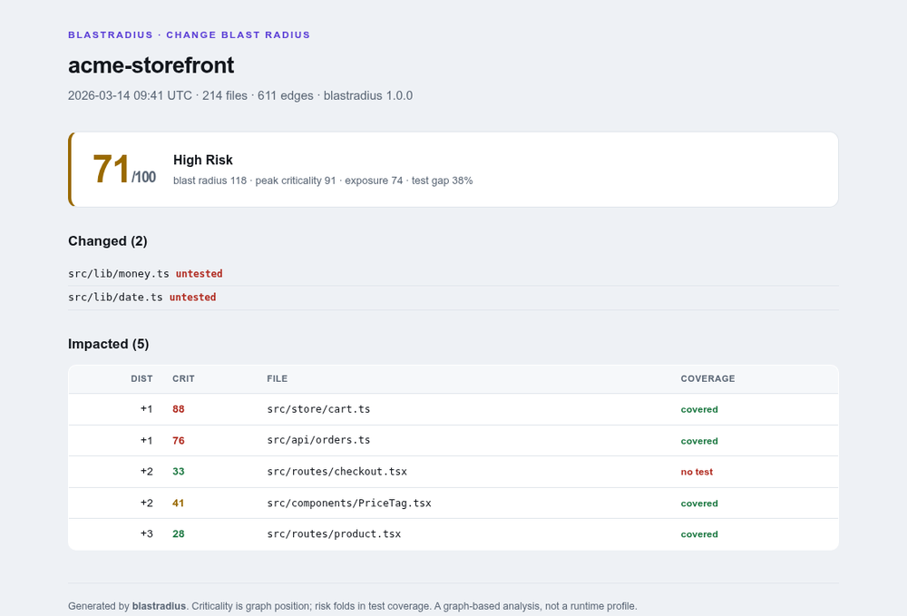
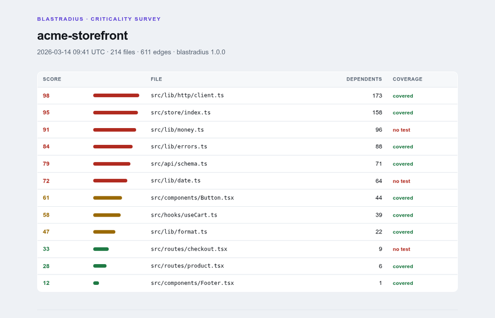
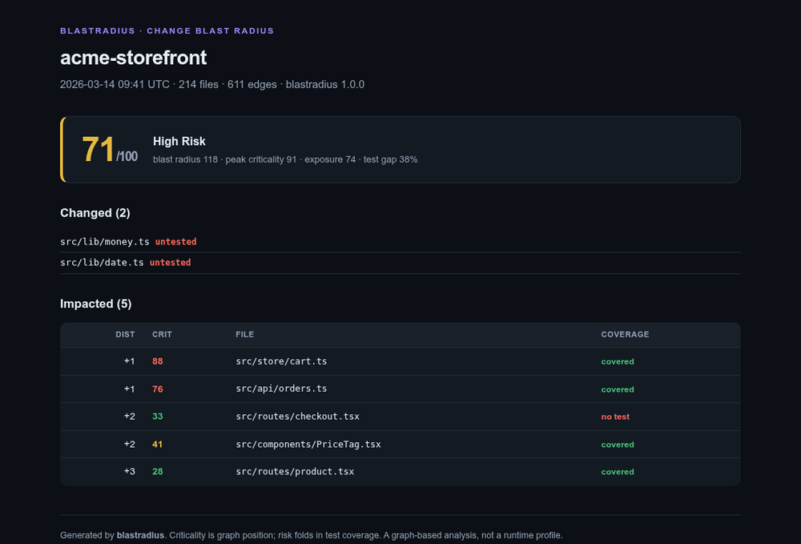

# blastradius

[](https://github.com/earbona23/blastradius/actions/workflows/ci.yml)
[](https://www.npmjs.com/package/blastradius)
[](https://nodejs.org)
[](package.json)
[](LICENSE)
[](https://github.com/sponsors/earbona23)

**What breaks if you change this?** `blastradius` is change-impact analysis for JavaScript
and TypeScript. It ranks every file by how catastrophic changing it would be, and shows the
blast radius of a diff — what could break, and which impacted files have no test — as a
single CI-gateable risk score.

One command, no install, no dependencies:

```sh
npx blastradius impact --since main
```



---

## Why

Every codebase has load-bearing files — a money helper, an HTTP client, a store — that
half the app quietly depends on. Change one and the damage isn't local; it ripples through
everything that imports it, transitively, and the scariest part of that ripple is the code
no test even touches. Coverage tools tell you what your tests hit. Nothing tells you *what
a specific change puts at risk*, ranked, before you merge.

That's blastradius. It builds your dependency graph (statically — it never runs your code)
and answers two questions:

- **`criticality`** — rank every file by how much of the codebase transitively leans on it.
  Finds the load-bearing code nobody documented, and flags the critical files with no test.
- **`impact`** — the blast radius of a change: everything that transitively imports what you
  touched, ranked by closeness and criticality, with a 0–100 risk score that folds in the
  test gap. Perfect as a CI gate: *"this PR touches critical, untested code — review hard."*



## Install

Run it with `npx` — nothing to install:

```sh
npx blastradius --help
```

Or install it:

```sh
npm install -g blastradius     # CLI everywhere
npm install -D blastradius     # in a project, for CI
```

Requires **Node 18.17+**. **Zero runtime dependencies** — the whole tool is Node builtins,
which means nothing third-party to audit and a supply chain of exactly one: you.

## Use it

```sh
# Rank the whole project by criticality
npx blastradius criticality

# Blast radius of your working changes vs a branch
npx blastradius impact --since main

# Or pass changed files explicitly (no git needed)
npx blastradius impact --files src/lib/money.ts,src/store/index.ts

# Export the dependency graph as a Mermaid diagram (renders on GitHub)
npx blastradius graph > graph.mmd
```

### As a CI gate

Fail a pull request when a change reaches too far into critical, untested code:

```sh
blastradius impact --since origin/main --max-risk 60
# exits non-zero if the risk score exceeds 60
```

```yaml
# .github/workflows/impact.yml
- run: npx blastradius impact --since origin/${{ github.base_ref }} --max-risk 60
```

### Path aliases & monorepos

```sh
blastradius criticality --alias @/=src/,~=./
```

## How the score works

Criticality blends two signals over the dependency graph: **reverse-reachability mass** (the
literal blast radius — how many files transitively depend on this one) and **PageRank** (are
those dependents themselves important). Risk for a change folds in four bounded factors —
blast size, peak criticality, exposure, and the **test gap** — into 0–100. Coverage is
computed from the graph, not by running tests: a file no test can even reach is flagged,
because a file nothing exercises is unambiguously untested. The full method, with the exact
weights, is in [docs/algorithm.md](docs/algorithm.md). It's deterministic — same project in,
same numbers out — so the CI gate is stable, not flaky.

## Outputs

| Format | Flag | |
|---|---|---|
| Terminal | *(default)* | Free |
| JSON | `--format json` | Free |
| Mermaid graph | `--format mermaid` | Free |
| HTML report | `--format html` | Pro |
| SARIF (GitHub Security tab) | `--format sarif` | Pro |

<details>
<summary>HTML report, dark mode</summary>


</details>

## Honest limitations

- **JS/TS by static import graph.** It follows `import`, `export … from`, `require()` and
  `import()` with string-literal specifiers. A `require(variableName)` or a fully dynamic
  `import(expr)` can't be resolved by anyone statically — blastradius counts these and prints
  them as blind spots rather than pretending the graph is complete.
- **Reachability coverage, not line coverage.** A file reachable from a test is "covered"
  here; that proves a test *loads* it, not that its branches are asserted. It is a strong
  proxy, not a replacement for a coverage runner.
- **It reads, it never runs.** Purely static — which is the point (safe on any repo), but it
  means runtime-only wiring (a plugin loaded by config, a route registered by string) isn't
  in the graph.
- **Not a substitute for review.** A low risk score means a change is contained and well
  tested by this graph's lights, not that it's correct.

## Support the project 💜

blastradius is free and MIT-licensed, and everything that computes an answer stays free —
the full analysis, terminal/JSON/Mermaid, and the CI gate. Two ways to keep it maintained:

- **[Sponsor on GitHub](https://github.com/sponsors/earbona23)** or **[back it on Patreon](https://www.patreon.com/EduardArbona)** — any amount, no strings.
- **[blastradius Pro](docs/pro.md)** — a one-time-activated, **offline** license (Ed25519,
  no account, no telemetry) that unlocks the HTML report, SARIF export and baseline
  comparison. Built for teams that live in this tool.

```sh
blastradius activate BLASTRADIUS-xxxxx.yyyyy   # verified locally, nothing phones home
blastradius license
```

Nothing the tool *computes* is behind the license — Pro is additive outputs, and sponsoring
is never required to use it.

## Development

```sh
npm test           # node --test test/*.test.js — zero dependencies
npm run typecheck  # tsc --checkJs — types via JSDoc, no build step
```

Collection (`src/graph/`) and algorithms (`src/analysis/`) are separate; the algorithms are
pure over the graph, tested against a fixture project with a hand-known structure, plus
guard tests that pin the static-only, zero-dependency and deterministic invariants.

## License

[MIT](LICENSE).
